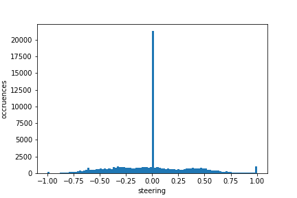
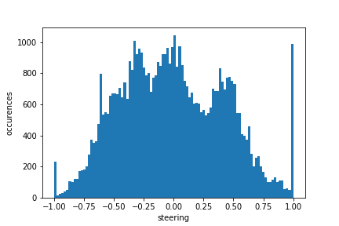

# Use Deep Learning to Clone Driving Behavior

[](http://www.udacity.com/drive)


## About this project

- This project uses a deep learning approach to clone the driving behaviour of a car in the without [car simulator](https://github.com/udacity/self-driving-car/) developed by Udcity.

- The trained model can successfully drive the car in both Lake Track and a much more challenging Tropical track. The videos of the driving can be found in
	- Lake Track:[YouTube](https://youtu.be/jZ_XtO-EU-Q)
	- Tropical(Challnge) Track:[YouTube](https://youtu.be/OyS8siF0Mpk)


## Files

The project includes the following main files:

- ```model.py```: The main script for training the model.
- ```drive.py``` for driving the car in autonomous mode.
- ```model.h5```: Keras model file of the trained model.
- ```image_preprocess.py```: Functions that do image processing.
- ```video_track1.mp4```: The video of running track 1 in autonomous mode with the setting "fastest" in the simulator.
- ```video_track2.mp4```: The video of running track 2 (challenge track) in autonomous mode with the setting "fastest" in the simulator.

## Model Architecture and Training Strategy

### Collection of the training dataset

I found the quality of training data is very critical to the success of enabling the car to finish the entire lap. With good quality of data, the size of training set can be greatly reduced.
Good training dataset should span a large volume of the "feature" space, that is, the dataset should cover as much as landscapes and driving scenarios as possible. On the other hand, bad driving behaviour in the dataset should be minimized because they are essentially nosiy data.

I found the following tips useful for collecting the driving data for training:

1. Making the turns as smooth as possible
Our model treat an image/steering pair as an independent event. A zig-zag turn will make the trained network make wrong judgement during the turn. For example, a zig-zag turn may have a moment that steering angle is zero, which gives wrong information during the training. I therefore recommend using a mouse or a joystick instead of using a keyboard, since keyboard strokes make the left and right turns more discrete.

2. Recovery data
Recovery data is very useful for rescuing the unexpected driving behavior. I deliberately steer a car off the center of the lane and record how it recovers. After that, I delete the data entries with steering value is zero, because these data entries contains the actions of driving the car towards the sideline, which should not be learned by the model.

## Dataset for validation

Rather than randomly selecting a portion of train dataset as the validation data in runtime, I use a completely separated driving data as the validation data. When I focused on training the car to drive track 1, I used the sample data provided by Udacity as the validation data. When I focused on training the car to drive on track 2, I use a small set of driving data on track 2 as the validation data to monior the training process.

### Preprocessing of the images
Each image was preprocessed by the following steps:(see ```image_preprocess.py``` )

- Remove the top 60 pixels that contains the landscape and the bottom 25 pixels that contains the car hood.

- Resize the image to 66x200, which is the input image size used in [NVidia paper](https://arxiv.org/abs/1604.07316).

- Convert the image from RGB space to HUV space.

### Construct the model
I use the [NVidia model](https://arxiv.org/abs/1604.07316) to train the data.
The overall modeling flow is illustrated as the following


### Data Augmentation and Resampling

Data augmentation can help generate more points in the "feature" space and thus make the trained model more robust. I also resample the data based on their steering values during the training so that the trained model will not favor a particular direction. 

The flow of data resampling and augmentation is illustrated as below:


#### Three cameras
I use all the three cameras to train the data. During the training, the model randomly select a camera image among the three. I added +/- 0.14 of steering values to the cameras. In principle, these offset values can be calculated by using trigonometry, however, I found that there are too many unknown variables to correctly determine the offsets added to steering values. I thus use an empirical approach with the following steps:

- Train a model with a regular driving dataset and some recovery driving data without using side cameras. The recovery driving data can "teach" the model how much steering value to use when the car deviates from the path.

- Make sure the trained model can drive the car reasonably well in the simulator.

- For each center camera image _I_, feed its associated side camera image data into the model, get their steering values _s(I')_.

- Run a linear regression to find an appropriate offset between _s(I)_ and _s(I')_.

This method will then provide a good starting point for the offset needed for the side cameras.


#### Flip the images horizontally
I filpped each image horizontally and multiply the steering value by -1 accordingly.


#### Brightness adjustment and translational shift (```aug_trans()``` and ```aug_brightness()```)
I randomly adjusted the contrast and shifting the pixels of each image following the method of [this blog post](https://chatbotslife.com/using-augmentation-to-mimic-human-driving-496b569760a9#.uug7vtl7i).


#### Resampling the data
The raw driving data contains large amount of entries with almost zero steering values:



First I select the 1% of the data with ```steering==0``` (see ```filter_zero_steering()```), the histogram becomes



Then I resample the data from each bin to balance the numbers of each bin: (see ```resample_df()```)


#### Alternating training
The advantage of uniform distriubtion in steering values is reducing the bias of the model toward any steering angles. However, resampling also prevents some images to be seen by the model during the training. Therefore, resampling forms another type of bias for training. This can be solved by carefully select the training data, but this takes a lot of time.

I therefore use an "alternaing" approach. I turn the resampling on and off between epochs. I found this approach is quite effective to prevent overfitting.


The code snippet for doing this is in the beginning of ```generator()```, like this:

```python
# Filter out steering==0.0 data
if alternating == True and filter == False:
    samples = filter_zero_steering(input_samples, keep_size=zero_size * 10)
else:
    samples = filter_zero_steering(input_samples, keep_size=zero_size)

if filter == True:
    samples = resample_df(samples)

# Alternate "filter" between True and False
if alternating == False:
    filter = start_filter_option
else:
    filter = (not filter)
```

### Model training and selection

I use Adam optimizer with a learning rate of 0.01 and mean squared error as the loss function to train the model. In this project, a model with low MSE values is not necessarily the best model. Low MSE values may indicate that the model is overfitted, particularly when the in-sample MSE is much lower than the MSE of validation set. Therefore, I saved the model after each epoch and select the best model by actualy seeing how the model drives in the simulator. 

## Results

After resampling, I trained the model with around 90000 images within an epoch. It took 10 epochs to achieve the result. The MSE against epochs is plotted in the below figure:


The trained model can drive the car fairly stable and almost stay at the center of its lane most of the time. The videos of the driving can be found in

- Lake Track:[YouTube](https://youtu.be/jZ_XtO-EU-Q)
- Tropical(Challnge) Track:[YouTube](https://youtu.be/OyS8siF0Mpk)
