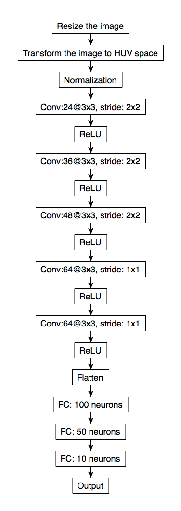
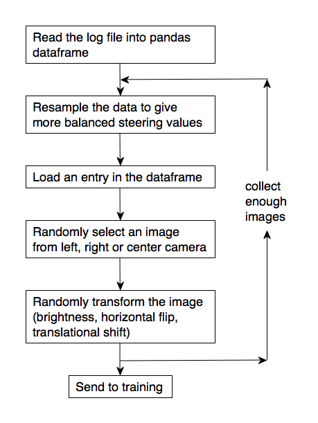
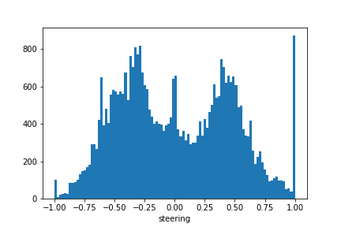

# Behavioral Cloning

## Overview

This project uses a deep learning approach to clone the driving behaviour of a car without explicitly identify the road features. The training data is generated by using the car simulator developed by Udcity. A deep learning model is then trained using these data to control a car in the simulator automatically.

## Dataset for training
### Preparation of the training dataset

I found the quality of training data is very critical to the success of enabling the car to finish the entire lap. With good quality of data, the size of training set can be greatly reduced.

Here are some tips that I found useful:

1. Making the turns as smooth as possible
Our model treat an image/steering pair as an independent event. A zig-zag turn will make the trained network make wrong judgement during the turn. For example, a zig-zag turn may have a moment that steering angle is zero, which gives wrong information during the training. I therefore recommend using a mouse or a joystick intead of using a keyboard, since keyboard strokes makes the left and right turns more discrete.

2. Recovery data
Recovery data is very useful in rescuing the unexpected driving behavior. I deliberately steer a car off the center of the lane and record how it recovers. After that, I delete the data entries with steering value is zero, because these entries contains the actions of driving the car towards the sideline, which increases noises in the training dataset.


## Models

I use the NVidia model to train the data.
The overall modeling flow is illustrated as the following




### Preprocessing
Each image was preprocessed by the following steps:

- Remove the top 60 pixels that contains the landscape and the bottom 25 pixels that contains the car hood.

- Resize the image to 66x200, which is the input image size used in NVidia paper.

- Convert the image from RGB space to HUV space.


### Data Augmentation and Resampling

The flow of data resampling and augmentation is illustrated as below:



#### Three cameras
I use all the three cameras to train the data. During the training, the model randomly select a camera image among the three. I added +/- 0.14 of steering values to the cameras. In principle, these offset values can be calculated by using trigonometry, however, I found that there are too many unknown variables to correctly determine the offsets added to steering values. I thus use an empirical approach with the following steps:

- Train a model with a regular driving dataset and some recovery driving data without using side cameras. The recovery driving data can "teach" the model how much steering value to use when the car deviates from the path.

- Make sure the trained model can drive the car reasonably well in the simulator

- For each center camera image _I_, feed its associated side camera image data into the model, get their steering values _s(I')_.

- Run a linear regression to find an appropriate offset between s(I) and s(I').

This method will then provide a good starting point for the offset needed for the side cameras.


#### Flip the images horizontally
I filpped each image horizontally and multiply the steering value by -1 accordingly.


#### Data augmention
I randomly adjusted the contrast and shifting the pixels of each image following the method of [this blog post](https://chatbotslife.com/using-augmentation-to-mimic-human-driving-496b569760a9#.uug7vtl7i).


#### Resampling the data
In the raw driving data contains large amount of entries with almost zero steering values:


First I select the 1% of the data with ```steering==0```, the histogram becomes


Then I resample the data from each bin to balance the numbers of each bin:




## Results


## Reflections

Making the car drive successfully in track 1 is not that difficult, but it took me much more time than I expected to tackle track 2. 